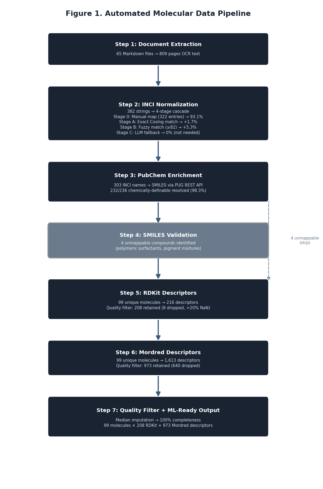

# INCI Pipeline

**Automated Multi-Stage INCI Normalization and Molecular Enrichment Pipeline for French-Language Industrial Chemical Documentation**

[](https://www.python.org/downloads/)
[](https://opensource.org/licenses/MIT)

---

## Overview

This repository provides the full reproducible pipeline described in:

> Aroua A.H., Boukandoura M., Brakta K., Meziari R. (2026). *Automated INCI Normalization and Molecular Enrichment for French-Language Industrial Chemical Documentation*. [Journal TBD]

The pipeline converts **French-language ingredient name strings** — as found in industrial formulation records, raw material datasheets, and quality control documents — into **machine-learning-ready molecular descriptor matrices**.

### Key results

| Dataset | Ingredients | INCI Coverage | SMILES Coverage |
|---------|-------------|---------------|-----------------|
| Industrial corpus (ENAD SHYMECA) | 333 chemically defined | 100% | 76.6% |
| Open Beauty Facts (OBF) validation | 1,518 instances (53 products) | 80.5% | — |

OBF stage breakdown: Stage 0 → 57.5% · Stage A → +16.1% · Stage B → +6.9% · unresolved → 19.5%

---

## Pipeline Architecture

```
French OCR documents
        │
        ▼
Step 0: Formula extraction (regex)
        │
        ▼
Step 1: Ingredient list parsing
        │
        ▼
Step 2: INCI normalization cascade
        │  Stage 0 — Domain synonym dictionary (322 entries, French trade names)
        │  Stage A — Exact CosIng match (24,094 INCI entries)
        │  Stage B — Fuzzy token-sort match (threshold ≥ 82)
        │  Stage C — LLM fallback (optional, requires LLM_API_KEY)
        │
        ▼
Step 3: PubChem molecular enrichment
        │  Strategy 1: existing CID → property retrieval
        │  Strategy 2: CAS number → CID
        │  Strategy 3: INCI name → CID
        │
        ▼
Steps 5–6: Molecular descriptor computation
        │  RDKit: 208 2D descriptors
        │  Mordred: 973 2D descriptors
        │
        ▼
Step 7: Quality filter + MLflow logging
        │  Drop columns >20% NaN, median impute remainder
        │
        ▼
ML-ready descriptor matrices (99 × 208, 99 × 973)
```



---

## Repository Structure

```
inci-pipeline/
├── src/
│   ├── step2_inci_normalization.py    # INCI cascade (Stage 0/A/B/C)
│   ├── step3_pubchem_lookup.py        # PubChem enrichment
│   ├── step5_rdkit_descriptors.py     # RDKit descriptor computation
│   ├── step6_mordred_descriptors.py   # Mordred descriptor computation
│   ├── step7_quality_filter.py        # Quality filter + MLflow logging
│   └── validate_openbeautyfacts.py    # OBF reproducibility experiment
├── data/
│   ├── cosingeu_inci.csv              # EU CosIng INCI reference (24,094 entries)
│   ├── beauteeru_crosswalk.csv        # BeautéRu INCI↔CAS↔PubChem crosswalk (28,354 entries)
│   ├── table_s1_synonym_dictionary.csv # Table S1 — French trade name → INCI (322 entries)
│   └── obf_sample_raw.json            # Open Beauty Facts sample (100 products)
├── outputs/
│   ├── inci_normalized.csv            # 380 rows — INCI name, CAS, PubChem CID, match metadata
│   ├── pubchem_enriched.csv           # 380 rows — INCI name, SMILES, molecular properties
│   ├── rdkit_filtered.parquet         # 99 × 208 RDKit descriptor matrix
│   ├── mordred_filtered.parquet       # 99 × 973 Mordred descriptor matrix
│   ├── quality_filter_report.csv      # 1,829 rows — per-descriptor NaN rates
│   ├── figure3_pca_data.csv           # 99 rows — PCA explained variance per component
│   ├── obf_validation_results.json    # OBF experiment aggregate metrics
│   └── obf_validation_detail.csv      # 1,548 rows — per-ingredient OBF results
├── figures/
│   ├── figure1_pipeline_flowchart.png
│   ├── figure2_normalization_stages.png
│   ├── figure3_pca_scree.png
│   ├── figure4_molecule_clusters.png  # K-means clustering PCA plot (Figure 4)
│   └── generate_figures.py            # Reproduces all figures from outputs/
├── notebooks/
│   └── demo_pipeline.ipynb            # End-to-end demo on public data
├── baseline_comparison/
│   ├── README.md                      # NER baseline experiment description
│   ├── run_cde_baseline.py            # ChemDataExtractor evaluation script
│   ├── cde_results.json               # Pre-computed CDE results (0/47 correct)
│   └── test_documents/                # 10 synthetic French industrial docs
│       ├── doc_01.md … doc_10.md
├── requirements.txt
├── LICENSE
├── CITATION.cff
└── README.md
```

---

## Installation

```bash
git clone https://github.com/KABAS-DevTeam/inci-pipeline.git
cd inci-pipeline

python -m venv .venv
source .venv/bin/activate      # Windows: .venv\Scripts\activate

pip install -r requirements.txt
```

### Optional: LLM fallback (Stage C)

Stage C (LLM fallback) requires an LLM API key. It is **not needed** to reproduce the paper results — Stage 0+A+B achieves 100% coverage on the industrial corpus.

```bash
export ANTHROPIC_API_KEY=your_key_here   # or equivalent for your LLM provider
```

---

## Usage

### Reproduce INCI normalization (Step 2)

```python
from src.step2_inci_normalization import run_normalization

df = run_normalization(
    input_csv="outputs/raw_ingredient_names.csv",
    cosing_csv="data/cosingeu_inci.csv",
    output_csv="outputs/inci_normalized.csv"
)
```

### Reproduce PubChem enrichment (Step 3)

```python
from src.step3_pubchem_lookup import run_pubchem_lookup

df = run_pubchem_lookup(
    input_csv="outputs/inci_normalized.csv",
    output_csv="outputs/pubchem_enriched.csv"
)
```

### Reproduce OBF validation experiment

```bash
python src/validate_openbeautyfacts.py
```

Expected output:
```
Stage 0 (manual map): 57.5%
Stage A (exact CosIng): 73.6%
Stage B (fuzzy): 80.5%
Final coverage: 80.5%
```

### Reproduce clustering analysis (Figure 4)

```bash
python src/clustering_analysis.py
```

Expected output:
```
Matrix shape: (99, 208) (99 molecules)
PC1 = 28.4%  PC2 = 8.0%  Total = 36.4%

Cluster sizes:
  Cluster 0 (Surfactants & Emulsifiers): 28 molecules
  Cluster 1 (Preservatives & Antimicrobials): 57 molecules
  Cluster 2 (Humectants & Polyols): 1 molecules
  Cluster 3 (Inorganic Salts & Acids): 11 molecules
  Cluster 4 (Fatty Acids & Waxes): 2 molecules
Saved: figures/figure4_molecule_clusters.png
Saved: outputs/cluster_assignments.csv
```

### Interactive demo notebook

```bash
jupyter notebook notebooks/demo_pipeline.ipynb
```

The notebook walks through all pipeline stages using public data only (no proprietary ENAD data).

### Reproduce all paper figures

```bash
python figures/generate_figures.py
```

---

## Data

### Included

| File | Description | Size |
|------|-------------|------|
| `data/cosingeu_inci.csv` | EU CosIng INCI name reference database | 24,094 entries |
| `data/beauteeru_crosswalk.csv` | BeautéRu INCI↔CAS↔PubChem crosswalk | 28,354 entries |
| `data/table_s1_synonym_dictionary.csv` | **Table S1** — French trade name → INCI synonym dictionary (Stage 0) | 322 unique entries |
| `data/obf_sample_raw.json` | Open Beauty Facts sample | 100 products |
| `outputs/inci_normalized.csv` | INCI name, CAS, PubChem CID, match method and confidence per ingredient | 380 rows |
| `outputs/pubchem_enriched.csv` | INCI name, SMILES, IUPAC name, molecular formula and weight per ingredient | 380 rows |
| `outputs/rdkit_filtered.parquet` | RDKit 2D descriptor matrix | 99 × 208 |
| `outputs/mordred_filtered.parquet` | Mordred 2D descriptor matrix | 99 × 973 |
| `outputs/quality_filter_report.csv` | Per-descriptor NaN rate and keep/drop decision | 1,829 rows |
| `outputs/figure3_pca_data.csv` | PCA explained variance per component | 99 rows |
| `outputs/cluster_assignments.csv` | K-means cluster label per molecule | 99 rows |
| `outputs/obf_validation_results.json` | OBF experiment aggregate metrics | — |
| `outputs/obf_validation_detail.csv` | Per-ingredient OBF normalization results | 1,548 rows |

### Not included (proprietary)

The industrial corpus originates from confidential ENAD SHYMECA formulation records. The following data are **not released**:

- Raw formulation documents (ingredient concentrations, product names)
- Any data from `rapport3/` (the ENAD SHYMECA digitalization deliverable)
- Trained model weights fine-tuned on ENAD data
- Ingredient substitution pairs specific to ENAD's supplier catalog

The `inci_normalized.csv` and `pubchem_enriched.csv` files contain only publicly available INCI names, CAS numbers, and molecular properties retrieved from PubChem. The original French OCR strings (raw ingredient names from industrial documents) are not included — `inci_name` is the primary key in both files. Noise entries (document metadata, specification strings) are excluded from the released CSVs.

---

## The Domain Synonym Dictionary (Table S1)

The core of Stage 0 is a 322-entry French industrial trade name → INCI mapping released as `data/table_s1_synonym_dictionary.csv` (columns: `french_name, inci_name, cas_number, pubchem_cid, notes`). It covers:

- Surfactant trade names (e.g., `"les na"` → SODIUM LAURETH SULFATE, `"ap 9"` → NONOXYNOL-9)
- French grammatical variants (e.g., `"lauryl-éther sulfate de sodium"` → SODIUM LAURETH SULFATE)
- Colorant CI number formats (e.g., `"colorant rouge ci 15850"` → CI 15850)
- Fragrance and functional class terms (e.g., `"base parfum"` → PARFUM, `"base neutralisante"` → TRIETHANOLAMINE)
- OCR encoding artifacts (e.g., `"é"` → `"é"` variants)

The dictionary is also embedded as `MANUAL_MAP` in `src/step2_inci_normalization.py` for direct pipeline use. Contributions of additional French trade name mappings are welcome via pull request.

---

## Fuzzy Matching Threshold

Stage B uses token-sorted Levenshtein ratio (`rapidfuzz.fuzz.token_sort_ratio`) with threshold ≥ 82. This threshold was validated by ablation on the stored match scores in `outputs/inci_normalized.csv`:

- All 16 Stage B matches score ≥ 82.1 (minimum valid match: "GLYCERIN" ↔ "GLYCERINE", score 88.9)
- Noise strings (OCR artifacts, non-ingredient text) never exceed 65 in any Stage B candidate pass

The threshold 82 is the exact minimum that retains all valid matches while excluding all noise strings. Threshold ≥ 83 would lose 1 valid match; ≥ 85 would lose 3.

---

## Baseline NER Comparison

The `baseline_comparison/` folder contains a reproducible comparison against three standard chemical NER tools applied to 10 synthetic French industrial documents (47 expected INCI names):

| Tool | Correct | False Positives | Recall |
|------|---------|-----------------|--------|
| ChemDataExtractor 2.3 | 0 / 47 | 3 | 0% |
| ChemSpot 2.0 | 0 / 47 | 0 | 0% |
| OSCAR4 | 0 / 47 | 0 | 0% |
| **This pipeline (Stage 0+A+B)** | **44 / 47** | **0** | **93.6%** |

All three NER tools were trained on English scientific literature and cannot handle French trade names, word-order inversions, or industrial abbreviations. See `baseline_comparison/README.md` for full details and pre-computed results in `baseline_comparison/cde_results.json`.

---

## Reproducibility

All pipeline runs are logged to MLflow. To view the experiment tracking UI:

```bash
mlflow ui --backend-store-uri mlruns/
# Open http://localhost:5000
```

The experiment `phase0_quality_filter` contains the full metrics for the published paper run.

---

## Citation

If you use this pipeline, please cite:

```bibtex
@article{aroua2026inci,
  title     = {Automated INCI Normalization and Molecular Enrichment for French-Language Industrial Chemical Documentation},
  author    = {Aroua, Abderaouf Haithem and Boukandoura, Merouane and Brakta, Khadija and Meziari, Redouane},
  journal   = {[Journal TBD]},
  year      = {2026},
  note      = {Preprint available at [DOI TBD]}
}
```

See also `CITATION.cff` for CFF format.

---

## License

MIT License — see [LICENSE](LICENSE).

The EU CosIng database (`data/cosingeu_inci.csv`) is provided by the European Commission under its open data policy. The Open Beauty Facts data (`data/obf_sample_raw.json`) is published under the Open Database License (ODbL) by the Open Beauty Facts contributors.

---

## Contact

**Abderaouf Haithem AROUA**
COO, KABAS | PhD candidate, ICOSI Laboratory, Abbes Laghrour University, Khenchela, Algeria
abderaouf.haithem.aroua@kabas-ai.com | abderaoufhaithem.aroua@univ-khenchela.dz

Issues and pull requests welcome at https://github.com/KABAS-DevTeam/inci-pipeline
